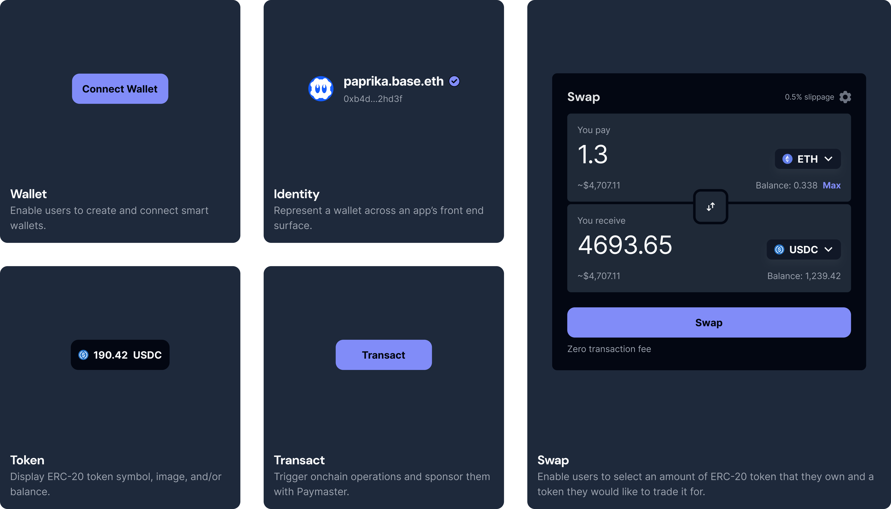

<<<<<<< HEAD

<!DOCTYPE html>
<html lang="en">
<head>
    <meta charset="UTF-8">
    <meta name="viewport" content="width=device-width, initial-scale=1.0">
    <title>Supabase Integration Documentation</title>
</head>
<body>
    <h1>Supabase Integration Documentation</h1>

    <h2>Overview</h2>
    
This documentation outlines our Supabase integration for wallet-based authentication and user management. The system provides a seamless flow between Web3 wallet authentication and Supabase user sessions.

    <h2>Architecture</h2>

    <h3>Key Components</h3>
    <ol>
        <li><strong>Supabase Clients</strong>
            <ul>
                <li><code>supabaseClient.js</code>: Regular client for authenticated user operations</li>
                <li><code>supabaseAdminClient.ts</code>: Admin client for user management operations</li>
            </ul>
        </li>
        <li><strong>Authentication Flow</strong>
            <ul>
                <li>Wallet connection triggers user creation/authentication</li>
                <li>JWT tokens are generated for Supabase session management</li>
                <li>User profiles are automatically synchronized</li>
            </ul>
        </li>
    </ol>

    <h3>Database Schema</h3>
    <pre>
<code>
-- user_profiles table
CREATE TABLE user_profiles (
  user_id uuid PRIMARY KEY REFERENCES auth.users(id),
  wallet_address text UNIQUE NOT NULL
  -- other profile fields
);
</code>
    </pre>

    <h3>Authentication Flow Details</h3>
    <h4>Initial Wallet Connection</h4>
    <pre>
<code>
// Triggered when wallet connects
await createSupabaseSession(address);
</code>
    </pre>

    <h4>Token Generation (<code>/api/auth/onchainkit</code>)</h4>
    <ul>
        <li>Validates wallet address</li>
        <li>Creates/finds user in <code>auth.users</code></li>
        <li>Creates/updates <code>user_profiles</code> record</li>
        <li>Generates JWT tokens for Supabase session</li>
    </ul>

    <h4>Session Management</h4>
    <ul>
        <li>Uses Supabase's <code>auth.setSession</code></li>
        <li>Manages token refresh automatically</li>
        <li>Maintains session across page reloads</li>
    </ul>

    <h2>Setup Requirements</h2>

    <h3>Environment Variables</h3>
    <pre>
<code>
NEXT_PUBLIC_SUPABASE_URL=your-project-url
NEXT_PUBLIC_SUPABASE_ANON_KEY=your-anon-key
SUPABASE_SERVICE_ROLE_KEY=your-service-role-key
SUPABASE_JWT_SECRET=your-jwt-secret
</code>
    </pre>

    <h3>Database Setup</h3>
    <ol>
        <li>Enable Row Level Security (RLS)</li>
        <li>Configure policies for <code>user_profiles</code> table</li>
        <li>Set up <code>auth</code> schema permissions</li>
    </ol>

    <h2>API Endpoints</h2>

    <h3>POST <code>/api/auth/onchainkit</code></h3>
    
<strong>Purpose:</strong> Generate Supabase session tokens for wallet address

    
<strong>Input:</strong> <code>{ address: string }</code>

    
<strong>Output:</strong> <code>{ supabaseToken: string, supabaseRefreshToken: string }</code>

    <h2>Usage Examples</h2>

    <h3>Connecting Wallet and Creating Session</h3>
    <pre>
<code>
const { address } = useAccount();

useEffect(() => {
  const initiateSupabaseSession = async () => {
    if (address) {
      try {
        // Get tokens from API
        const response = await fetch('/api/auth/onchainkit', {
          method: 'POST',
          body: JSON.stringify({ address }),
        });
        const { supabaseToken, supabaseRefreshToken } = await response.json();

        // Create Supabase session
        await createSupabaseSession(supabaseToken, supabaseRefreshToken);
      } catch (error) {
        console.error('Session creation failed:', error);
      }
    }
  };

  initiateSupabaseSession();
}, [address]);
</code>
    </pre>

    <h3>Accessing User Data</h3>
    <pre>
<code>
const getUserProfile = async () => {
  const { data, error } = await supabase
    .from('user_profiles')
    .select('*')
    .single();

  if (error) throw error;
  return data;
};
</code>
    </pre>

    <h2>Security Considerations</h2>
    <ul>
        <li><strong>JWT Token Management</strong>
            <ul>
                <li>Tokens are short-lived (30 minutes)</li>
                <li>Refresh tokens handled securely</li>
                <li>No token storage in <code>localStorage</code></li>
            </ul>
        </li>
        <li><strong>Row Level Security</strong>
            <ul>
                <li>Users can only access their own data</li>
                <li>Admin operations restricted to service role</li>
            </ul>
        </li>
        <li><strong>Wallet Address Validation</strong>
            <ul>
                <li>Addresses normalized to lowercase</li>
                <li>Verification before token generation</li>
            </ul>
        </li>
    </ul>

    <h2>Troubleshooting</h2>

    <h3>Common Issues and Solutions</h3>
    <ul>
        <li><strong>Session Not Creating</strong>
            <ul>
                <li>Check environment variables</li>
                <li>Verify wallet connection</li>
                <li>Check browser console for errors</li>
            </ul>
        </li>
        <li><strong>Database Access Issues</strong>
            <ul>
                <li>Verify RLS policies</li>
                <li>Check user authentication status</li>
                <li>Confirm service role permissions</li>
            </ul>
        </li>
        <li><strong>Token Errors</strong>
            <ul>
                <li>Validate JWT secret configuration</li>
                <li>Check token expiration</li>
                <li>Verify token format</li>
            </ul>
        </li>
    </ul>

    <h2>Resources</h2>
    <ul>
        <li><a href="https://supabase.com/docs">Supabase Documentation</a></li>
        <li><a href="https://nextjs.org/docs">Next.js Documentation</a></li>
        <li><a href="https://ethereum.org/en/developers/docs/">Web3 Authentication Best Practices</a></li>
    </ul>

  

    
  

## ✨ Documentation

For documentation and guides, visit [onchainkit.xyz](https://onchainkit.xyz/).

 

## 🌁 Team and Community

- **OnchainKit** ([X](https://x.com/Onchainkit), [Warpcast](https://warpcast.com/onchainkit))
- [Tina He](https://github.com/fakepixels) ([X](https://twitter.com/fkpxls))
- [Mind Apivessa](https://github.com/mindapivessa) ([X](https://twitter.com/spicypaprika_))
- [Alissa Crane](https://github.com/abcrane123) ([X](https://twitter.com/abcrane123))
- [Alec Chen](https://github.com/0xAlec) ([X](https://twitter.com/0xAlec))
- [Paul Cramer](https://github.com/cpcramer) ([X](https://twitter.com/PaulCramer_))
- [Shelley Lai](https://github.com/0xchiaroscuro) ([X](https://twitter.com/hey_shells), [Warpcast](https://warpcast.com/chiaroscuro))
- [Léo Galley](https://github.com/kirkas)
- [Adam Lessey](https://github.com/alessey) ([X](https://twitter.com/alessey))

## 💫  Contributors

## 🌊 License

This project is licensed under the MIT License - see the [LICENSE.md](LICENSE.md) file for details
=======

  

    
  

  <h1 style="font-size: 3em; margin-bottom: 20px;">
    OnchainKit
  </h1>

  

    React components and TypeScript utilities to help you build top-tier onchain apps.
  

  
  
  
  
  

  
  
  
  

 

## ✨ Documentation

For documentation and guides, visit [onchainkit.xyz](https://onchainkit.xyz/).

 

## 🌁 Team and Community

## 💫  Contributors

## 🌊 License
